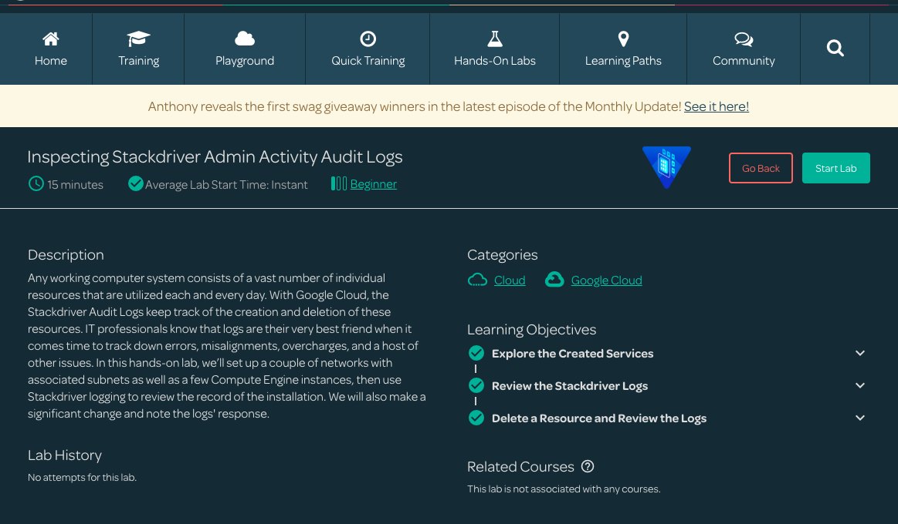
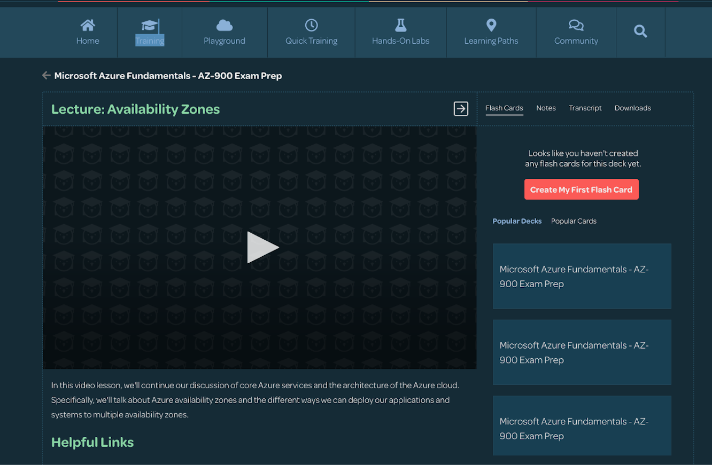

# Linux Academy Dark Mode

A [Stylus](https://github.com/openstyles/stylus) css theme for linuxacademy.com courses.

To get the theme, install the [Stylus Chrome extension](https://chrome.google.com/webstore/detail/stylus/clngdbkpkpeebahjckkjfobafhncgmne?hl=en) and go [here](https://userstyles.org/styles/175278/linux-academy-courses-dark-mode).

### Examples:

#### app.linuxacademy.com

#### Courses

